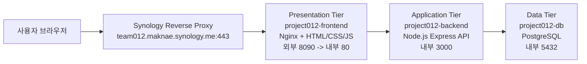

# Project012 - 3-Tier 피싱 위험성 교육 웹서비스

Synology NAS DS420+ 환경에서 Docker와 Docker Compose를 이용해 실행하는 3-tier 구조의 교육용 웹서비스입니다. 사용자가 포털 로그인과 비슷한 화면에서 정보를 입력하면, 실제 피싱 상황에서 어떤 정보가 노출될 수 있는지 확인하고 삭제할 수 있도록 구성했습니다. 현재 `https://team012.maknae.synology.me:443`로 접속하여 로그인, 경고확인, 탈취된 정보 확인이 가능합니다.
본 프로젝트는 개인정보보호를 위해 7월전에 비공개될 예정입니다.

> 주의: 본 프로젝트는 보안 교육 목적의 모의 피싱 시뮬레이션입니다. 실제 상표, 로고, 문구를 복제하지 않으며 비밀번호 원문도 저장하지 않습니다. 데이터베이스에는 사용자 식별자, 비밀번호 길이, 마스킹된 미리보기, 접속 정보만 저장됩니다. 

## 1. 프로젝트 목표

- Docker Compose 기반으로 전체 서비스를 한 번에 실행
- Presentation, Application, Data 계층을 분리한 3-tier 구조 구현
- 로그인 입력 → 위험 안내 → 저장된 모의 노출 정보 확인 흐름 구현

## 2. 전체 구조

```text
Project012/
├── backend/
│   ├── Dockerfile
│   ├── package.json
│   └── src/
│       └── server.js
├── frontend/
│   ├── Dockerfile
│   ├── nginx.conf
│   └── public/
│       ├── app.js
│       ├── index.html
│       └── styles.css
├── docker-compose.yml
├── .env.example
├── README.md
└── CodexPrompt.md
```

## 3. 주요 기능

### 로그인 스크린

- 아이디와 비밀번호 입력
- 로그인 버튼 클릭 시 백엔드 API로 모의 노출 정보 저장
- 실제 서비스 사칭을 막기 위해 교육용 문구 사용

### 탈취당함 스크린

- 스미싱/피싱 위험 안내
- 입력 정보가 어떤 식으로 공격자에게 전달될 수 있는지 설명
- 탈취 정보 확인 화면으로 이동하는 버튼 제공

### 탈취 정보 확인 스크린

- DB에 저장된 모의 노출 기록 표 표시
- 비밀번호는 원문 대신 마스킹된 값과 길이만 표시
- 전체 정보 삭제 버튼
- 처음으로 돌아가기 버튼

## 4. API 명세

| Method | Endpoint | 설명 |
| --- | --- | --- |
| `GET` | `/api/health` | 백엔드 상태 확인 |
| `POST` | `/api/captures` | 모의 노출 정보 저장 |
| `GET` | `/api/captures` | 저장된 모의 노출 정보 조회 |
| `DELETE` | `/api/captures` | 저장된 정보 전체 삭제 |

저장 데이터 예시:

```json
{
  "identifier": "student@example.com",
  "password_mask": "pa******",
  "password_length": 8,
  "user_agent": "Mozilla/5.0 ...",
  "ip_address": "::ffff:172.18.0.1",
  "created_at": "2026-05-17T12:00:00.000Z"
}
```
## 5. 3-Tier 계층 설명 및 컨테이너 흐름도

본 프로젝트는 웹서비스를 Presentation Tier, Application Tier, Data Tier로 분리한 3-tier 구조로 설계했습니다. 사용자는 프론트엔드 화면에 접속하고, 프론트엔드는 백엔드 API를 호출하며, 백엔드는 데이터베이스에 모의 노출 정보를 저장하거나 조회합니다.



### Presentation Tier

Presentation Tier는 `frontend` 컨테이너가 담당합니다. 사용자가 직접 보는 로그인 화면, 위험 안내 화면, 탈취 정보 확인 화면을 제공합니다.

- 컨테이너 이름: `project012-frontend`
- 주요 파일: `frontend/public/index.html`, `frontend/public/styles.css`, `frontend/public/app.js`
- 서버: Nginx
- 역할: 정적 웹 페이지 제공, `/api/*` 요청을 백엔드 컨테이너로 프록시
- 포트: 컨테이너 내부 `80`, 호스트 외부 `8090`
- 접속 주소: `https://team012.maknae.synology.me`

### Application Tier

Application Tier는 `backend` 컨테이너가 담당합니다. 프론트엔드에서 전달된 요청을 처리하고, 입력된 모의 노출 정보를 DB에 저장하거나 조회/삭제합니다.

- 컨테이너 이름: `project012-backend`
- 주요 파일: `backend/src/server.js`
- 런타임: Node.js + Express
- 역할: REST API 제공, 입력값 검증, 비밀번호 마스킹 처리, DB 질의 실행
- 포트: 컨테이너 내부 `3000`
- 외부 노출: 없음. Docker 내부 네트워크에서 `frontend` 컨테이너만 접근
- 주요 API: `GET /api/health`, `POST /api/captures`, `GET /api/captures`, `DELETE /api/captures`

### Data Tier

Data Tier는 `db` 컨테이너가 담당합니다. PostgreSQL을 사용하여 모의 탈취 기록을 저장합니다.

- 컨테이너 이름: `project012-db`
- 이미지: `postgres:16-alpine`
- 역할: 모의 노출 정보 저장, 조회, 삭제
- 포트: 컨테이너 내부 `5432`
- 외부 노출: 없음. Docker 내부 네트워크에서 `backend` 컨테이너만 접근
- 데이터 유지 방식: Docker volume `postgres_data` 사용

## 6. 각 컨테이너의 역할

| 컨테이너 | 계층 | 역할 |
| --- | --- | --- |
| `project012-frontend` | Presentation Tier | 사용자 화면 제공, 정적 파일 서빙, API 프록시 |
| `project012-backend` | Application Tier | API 처리, 비즈니스 로직, DB 연결 |
| `project012-db` | Data Tier | PostgreSQL 데이터 저장소 |

## 7. 컨테이너 간 연결 방식

Docker Compose는 같은 compose 파일에 정의된 컨테이너들을 하나의 내부 네트워크에 연결합니다. 따라서 컨테이너끼리는 `localhost`가 아니라 서비스 이름으로 통신합니다.

- 브라우저 -> 'https://team012.maknae.synology.me:443'로 접속
- `frontend` -> `backend`: Nginx가 `/api/` 요청을 `http://backend:3000/api/`로 프록시
- `backend` -> `db`: 환경변수 `DB_HOST=db`를 이용해 PostgreSQL에 접속

요청 흐름은 다음과 같습니다.

```text
사용자 브라우저
  -> frontend 컨테이너(Nginx, 80번 포트)
  -> backend 컨테이너(Express, 3000번 포트)
  -> db 컨테이너(PostgreSQL, 5432번 포트)
```

## 8. 사용 포트와 주요 설정

| 항목 | 값 | 설명 |
| --- | --- | --- |
| 프론트엔드 외부 포트 | `8090` | 사용자가 접속하는 포트 |
| 프론트엔드 내부 포트 | `80` | Nginx가 정적 파일을 제공하는 포트 |
| 백엔드 내부 포트 | `3000` | Express API 서버 포트 |
| DB 내부 포트 | `5432` | PostgreSQL 기본 포트 |
| DB 이름 | `POSTGRES_DB` | `.env`에서 설정 |
| DB 사용자 | `POSTGRES_USER` | `.env`에서 설정 |
| DB 비밀번호 | `POSTGRES_PASSWORD` | `.env`에서 설정 |
| DB 볼륨 | `postgres_data` | 컨테이너 재시작 후에도 데이터 유지 |

Synology NAS에서는 DSM 역방향 프록시를 다음처럼 설정합니다.

```text
소스 프로토콜: HTTPS
소스 호스트 이름: team012.maknae.synology.me
소스 포트: 443
대상 프로토콜: HTTP
대상 호스트 이름: localhost
대상 포트: 8090
```

## 9. 실행 방법

개발 PC에서 cmd창으로 ssh를 이용해서 nas에 접속해야합니다.
PS C:\Users\Project012> ssh -p 포트번호 호스트이름@maknae.synology.me
호스트이름@maknae.synology.me's password:
호스트이름@maknae_st:/docker$ git clone https://github.com/Nammaknae/phishing_app_flutter.git
호스트이름@maknae_st:/docker/Project012$ docker compose -d 

여기서 docker compose -d가 deny될경우 권한 설정으로 인하여 거부가 된것이니
sudo docker compose -d 를 하여 관리자 권한으로 실행되도록 해야합니다.
 ✔ Container project012-db        Healthy                                                                       
 ✔ Container project012-backend   Healthy                                                                       
 ✔ Container project012-frontend  Healthy (Started도 가능)
라고 뜨면 실행 완료

## 10. 보안 및 윤리적 제한

- 실제로 사용하고 있는 사이트의 UI를 복제하지 않습니다.
- 실제 계정 탈취 목적으로 사용하지 않습니다.
- 입력된 비밀번호 원문은 저장하지 않습니다.
- 교육 후에는 `정보 삭제` 버튼 또는 `docker compose down -v`로 데이터를 삭제합니다.